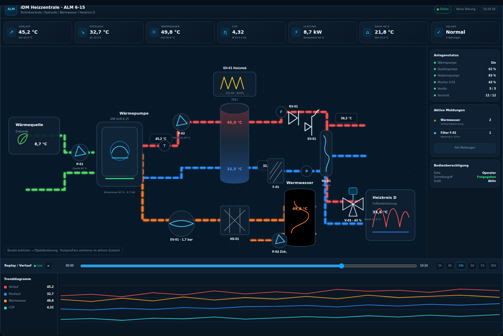
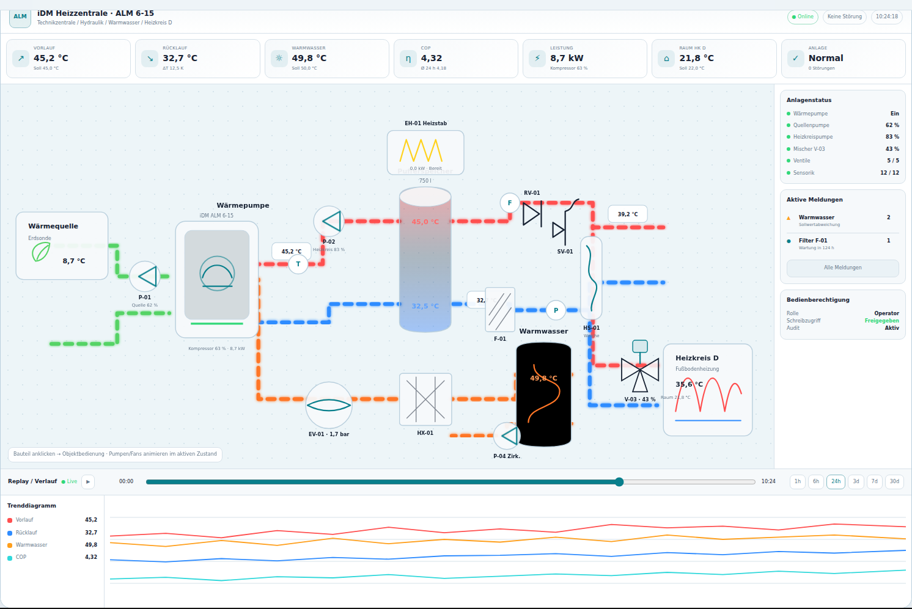
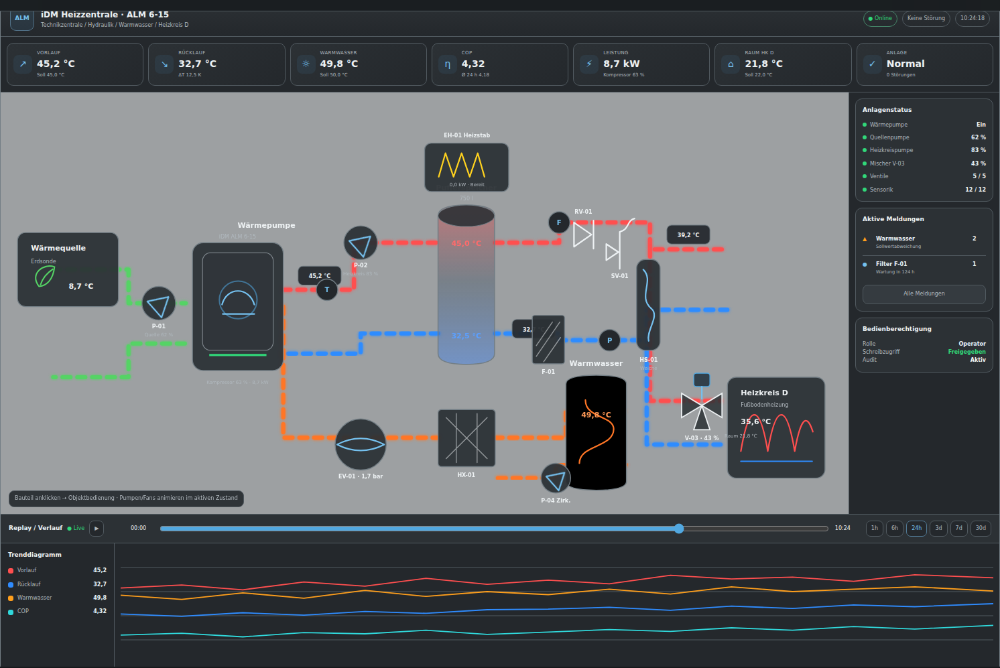
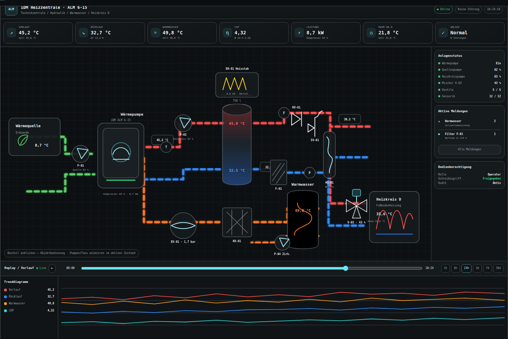
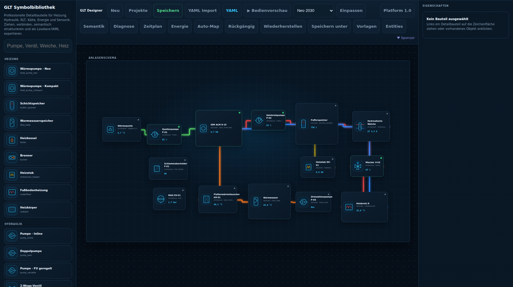
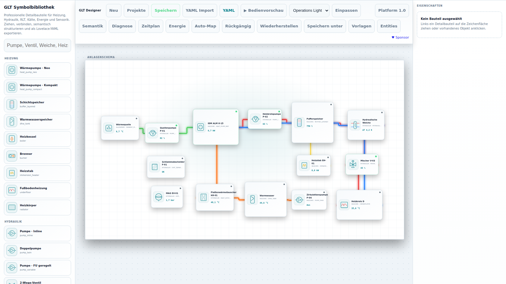
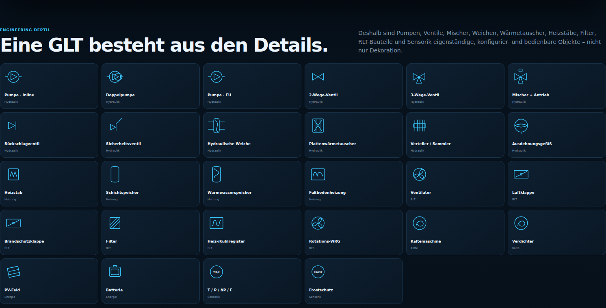

# GLT Flow Card

[](https://hacs.xyz/)
[](LICENSE)
[](https://www.home-assistant.io/)

**GLT Flow Card** is a modern, freely configurable building-management / BMS visualization for Home Assistant. It combines a professional plant schematic with live Home Assistant entities, animated media flows, optional plant photos, history replay, multi-series trends and customer-specific KPI tiles.

*[Deutsche Version](README.de.md)*

> The project is independent and is not affiliated with iDM Energiesysteme. The concept is inspired by professional GLT/BMS visualizations and by public [iVIS](https://www.idm-energie.at/ivis/) product features, while using its own UI, code and configuration model.

<!-- GLT-SHOWCASE:START -->

## GLT / SCADA showcase

The following images are generated automatically from the **current GitHub Pages UI and current online designer**. They show the same detailed plant in different visual systems — without custom plant images: pumps, 2/3-way valves, mixers, hydraulic separators, immersion heaters, tanks, heat exchangers, sensors, media paths, alarms, replay and trends.

<table>
<tr><th width="50%">Neo 2030 · Dark</th><th width="50%">Neo / Operations · Light</th></tr>
<tr><td></td><td></td></tr>
</table>

<table>
<tr><th width="50%">Classic SCADA</th><th width="50%">P&amp;ID Dark</th></tr>
<tr><td></td><td></td></tr>
</table>

### Designer · dark and light

<table>
<tr><th width="50%">Designer Dark</th><th width="50%">Designer Light</th></tr>
<tr><td></td><td></td></tr>
</table>

### Detailed symbol library



> Controllable plant objects can open an equipment control panel in Home Assistant or execute configured HA services. The GitHub Pages demo simulates this control layer without switching a real plant.

<!-- GLT-SHOWCASE:END -->

<!-- GLT-V1:START -->

## GLT Engineering Platform 1.0

**Version 1.0** evolves GLT Flow Card from a visualization into a Home Assistant based GLT/BMS/SCADA engineering platform while keeping the six visual presets and the drag-and-drop workflow.

- complete operational-state model: Auto, Manual, Local, Remote, Fault, Warning, Locked, Interlock, Maintenance, communication/stale/invalid and command states;
- rich equipment controls with server-side authorization through the Companion;
- alarm lifecycle 2.0 with priority/class, hysteresis, delay, acknowledgement/comment, shelving, history, notifications and escalation;
- weekly schedules and calendars; semantic site/building/floor/system/equipment hierarchy;
- automatic Home Assistant entity mapping and parametric equipment profiles;
- 250+ symbol variants, smart ports, obstacle-aware routing and CAD engineering tools;
- drill-down, Historian aggregation, simulation, commissioning diagnostics, energy, maintenance/work orders and reports;
- remote Home Assistant sites, plugin SDK, project diff, `.gltproject` bundles, server audit/locking and i18n foundation.

> The **GLT Flow Card Companion** is recommended for secure controls, cross-device projects, alarms, schedules, audit, locks and remote Home Assistant sites. The dashboard card still works standalone.

**[Design Showcase](https://xerolux.github.io/glt-flow-card/showcase.html)** · **[Platform 1.0](https://xerolux.github.io/glt-flow-card/platform.html)** · **[Online Designer](https://xerolux.github.io/glt-flow-card/editor/)**

<!-- GLT-V1:END -->


## Highlights

- **Professional GLT canvas** with freely positioned equipment, data points and media paths.
- **Pan & zoom** with mouse, wheel, touch drag and pinch zoom.
- **Multiple views** such as `Anlagenschema`, `Anlagenbild`, floor plan or detail view.
- **Data-point localization between views**: the same entity can have a different position on a schematic and on a real plant photo.
- **Animated flow paths** for heating, cooling, DHW, source circuits, air systems and electrical power.
- **Replay mode with time bar** using Home Assistant Recorder/History data.
- **Trend diagrams with multi-selection** of data points.
- **Custom KPIs** backed by any Home Assistant entity or template sensor.
- **Custom images** for complete views or individual equipment objects.
- **Live / replay values at the exact plant position**.
- **Light/dark theme aware** and responsive.
- **Full drag & drop plant designer** for equipment, media paths, data points, KPIs and image views — YAML remains available for advanced setups.

## Installation

Requires Home Assistant 2024.8.0 or newer. Release validation installs the exact
staged dashboard card and Companion ZIP on immutable minimum/current HA lanes.

### HACS

1. HACS → three dots → **Custom repositories**.
2. Add `https://github.com/Xerolux/glt-flow-card` as **Dashboard**.
3. Install **GLT Flow Card** and reload Home Assistant.

### Manual

1. Copy `dist/glt-flow-card.js` to `config/www/glt-flow-card.js`.
2. Add `/local/glt-flow-card.js` as a **JavaScript module** under Dashboard resources.

## Drag & Drop Designer

The visual editor is now a complete plant designer instead of a form for global options only. Open the card editor in Home Assistant and build the plant directly on the canvas:

- drag equipment, media paths, data points and KPIs from the component palette;
- move and resize equipment directly on the plant canvas;
- edit pipe routing with draggable control points;
- assign Home Assistant entities in the property inspector;
- add image views and place the same data point independently on schematic and plant photo;
- use grid snapping, zoom, duplicate, delete, keyboard nudging, undo and redo;
- use custom image/SVG URLs for complete views or individual equipment.

The editor writes the same YAML configuration documented below, so visual editing and hand-written YAML can be mixed at any time.


## Neo 2030, Clean and Classic SCADA

The card now ships with three complete visual presets. **Neo 2030** is the new dark premium look with modern symbols, restrained glow and technical typography. **Clean** keeps the bright minimal look. **Classic SCADA** remains available for users who prefer a traditional BMS/SCADA presentation. The style can be selected in the designer and optionally switched directly on the card.

## Native Home Assistant entity picker and YAML export

The integrated designer no longer requires typing entity IDs by hand. Main entities, status entities, measurements, flow/activity signals and KPIs use Home Assistant's native entity picker with sensible domain filters, giving direct access to the current Home Assistant entity catalog.

The designer also includes a **live preview** and a **Lovelace YAML drawer with copy action**, so a visually created plant can be pasted directly into a manual dashboard as `custom:glt-flow-card`.

## Extended symbol library

The palette contains more than 50 components and variants across heating, hydraulics, AHU/ventilation, cooling, energy, sensors and generic plant objects, while custom images/SVGs remain optional.


## Engineering Workspace 0.4


Version 0.4 turns the card into a broader **Home Assistant GLT/BMS engineering workspace**. Existing Lovelace YAML can be imported, visually edited and exported again; unknown configuration keys are kept in the project object instead of intentionally being removed.

- YAML round-trip with file import, clipboard copy and download.
- Project library, autosave and version history; browser-local by default, Home Assistant storage with the optional companion backend.
- User component templates, grouped sub-plants and orthogonal auto-routing tied to equipment.
- Alarm/message panel with optional acknowledgement service.
- Viewer / operator / designer roles and audit log.
- Maintenance assets with operating hours, intervals, due dates, documents and parts metadata.
- Multi-site overview and filtering.
- Trend+ with multiple Y axes by unit, min/max/average, power-to-energy integration, 24 h comparison and CSV export.
- CSV and print/PDF reports.
- Built-in GitHub Pages documentation, hosted online editor and Wiki source sync.

**[Live documentation & online editor](https://xerolux.github.io/glt-flow-card/)** · **[Wiki](https://github.com/Xerolux/glt-flow-card/wiki)**

### Neo 2030 runtime


### Home Assistant drag-and-drop designer


### Clean designer option


## Quick start

```yaml
type: custom:glt-flow-card
title: Heating centre
canvas:
  width: 1600
  height: 900
  viewport_height: 620
views:
  - id: schematic
    name: Plant schematic
    kind: schematic
  - id: plant
    name: Plant photo
    kind: image
    background: /local/glt/plant-room.jpg

equipment:
  - id: hp
    type: heat_pump
    name: Heat pump
    x: 120
    y: 320
    width: 260
    entity: switch.heat_pump
    state_entity: binary_sensor.heat_pump_running
    fields:
      - label: Flow
        entity: sensor.heat_pump_flow_temperature
      - label: Return
        entity: sensor.heat_pump_return_temperature

paths:
  - id: supply
    medium: heating_supply
    flow: binary_sensor.heat_pump_running
    temperature: sensor.heat_pump_flow_temperature
    points:
      - [380, 370]
      - [760, 370]
      - [760, 220]

datapoints:
  - id: flow_temp
    label: Flow
    kind: temperature
    entity: sensor.heat_pump_flow_temperature
    positions:
      schematic: { x: 620, y: 335 }
      plant: { x: 930, y: 240 }

kpis:
  - name: COP
    icon: mdi:gauge
    entity:
      entity: sensor.heat_pump_cop
      decimals: 2
```

## Configuration model

### Views

A view can be a drawn GLT schematic or a real image. Any number of views is possible.

```yaml
views:
  - id: schematic
    name: Anlagenschema
    kind: schematic
  - id: photo
    name: Anlagenbild
    kind: image
    background: /local/glt/heating-centre.jpg
    background_fit: cover
  - id: ventilation
    name: RLT
    kind: schematic
```

For `kind: image`, paths and equipment are hidden by default while data points remain visible. Set `show_paths: true` or `show_equipment: true` if desired.

### Equipment

Built-in equipment types are currently:

`heat_pump`, `tank`, `pump`, `fan`, `valve`, `heat_exchanger`, `boiler`, `ahu`, `room`, `meter`, `solar`, `pv`, `grid`, `generic`, `image`.

```yaml
equipment:
  - id: buffer
    type: tank
    name: Buffer tank
    x: 650
    y: 250
    width: 240
    height: 220
    entity: sensor.buffer_top
    fields:
      - label: Top
        entity: sensor.buffer_top
      - label: Bottom
        entity: sensor.buffer_bottom
```

Use your own asset on a node:

```yaml
equipment:
  - id: custom_machine
    type: image
    name: Machine 1
    image: /local/glt/machine.svg
    x: 500
    y: 180
    width: 280
    fields:
      - label: Power
        entity: sensor.machine_power
    slots:
      - label: T1
        entity: sensor.machine_t1
        x: 60
        y: 120
```

### Media paths

Each path is a polyline in logical canvas pixels.

```yaml
paths:
  - id: hk_d_supply
    medium: heating_supply
    flow: binary_sensor.heating_circuit_d_pump
    temperature: sensor.heating_circuit_d_flow_temperature
    width: 8
    speed: 1.2
    points:
      - [820, 300]
      - [1160, 300]
      - [1160, 470]
```

Available media presets: `heating_supply`, `heating_return`, `cooling_supply`, `cooling_return`, `dhw`, `cold_water`, `source`, `air_supply`, `air_extract`, `air_outdoor`, `air_exhaust`, `electrical`, `neutral`. A custom path may override the preset with `color:`.

### Data points and image localization

```yaml
datapoints:
  - id: return_b34
    label: Return B34
    kind: temperature
    entity:
      entity: sensor.return_b34
      decimals: 1
    positions:
      schematic: { x: 960, y: 520 }
      photo: { x: 428, y: 356 }
```

This is the core of the **schema ↔ plant image** workflow: one data point, one entity, multiple physical positions.

### KPIs

KPIs are intentionally entity based. For calculated KPIs, create a Home Assistant template sensor and display it here.

```yaml
kpis:
  - name: COP
    icon: mdi:gauge
    entity: sensor.idm_cop
    good_above: 4
    warn_below: 3
    critical_below: 2
  - name: Heat output
    icon: mdi:radiator
    entity: sensor.idm_heat_output
  - name: Electrical power
    icon: mdi:flash
    entity: sensor.idm_electrical_power
```

### Replay mode

Replay uses the Home Assistant History API / Recorder data.

```yaml
replay:
  enabled: true
  hours: 168
  step_minutes: 15
  autoplay_ms: 900
```

Press the history button, move the timeline or start playback. Values, states and flow activity follow the selected historical time.

### Multi-select trends

```yaml
trend:
  enabled: true
  hours: 168
  max_series: 8
  height: 260
```

Open **Trend**, select several configured data points and compare their history in one diagram. Data points with `trend: false` are excluded from the selector.

## iDM example

[`examples/idm-alm6-15.yaml`](examples/idm-alm6-15.yaml) shows a GLT-style visualization for an iDM heat-pump installation, including heating circuit D, a buffer / hydraulic area, replay, KPIs and a second view for a real plant-room photo.

## Files

- `dist/glt-flow-card.js` – HACS / production card.
- `examples/` – ready-to-adapt YAML configurations.
- `docs/` – documentation and screenshots.
- `test/` – lightweight validation tests.

## Roadmap

- Drag-and-drop plant designer in the Home Assistant card editor.
- Additional GLT symbols and DIN/ISO-style symbol variants.
- Alarm/event list and acknowledgement view.
- Per-unit trend axes and statistics panels.
- Room manager / floor-plan widgets.
- Plant-park / multi-site overview.

## License

MIT
